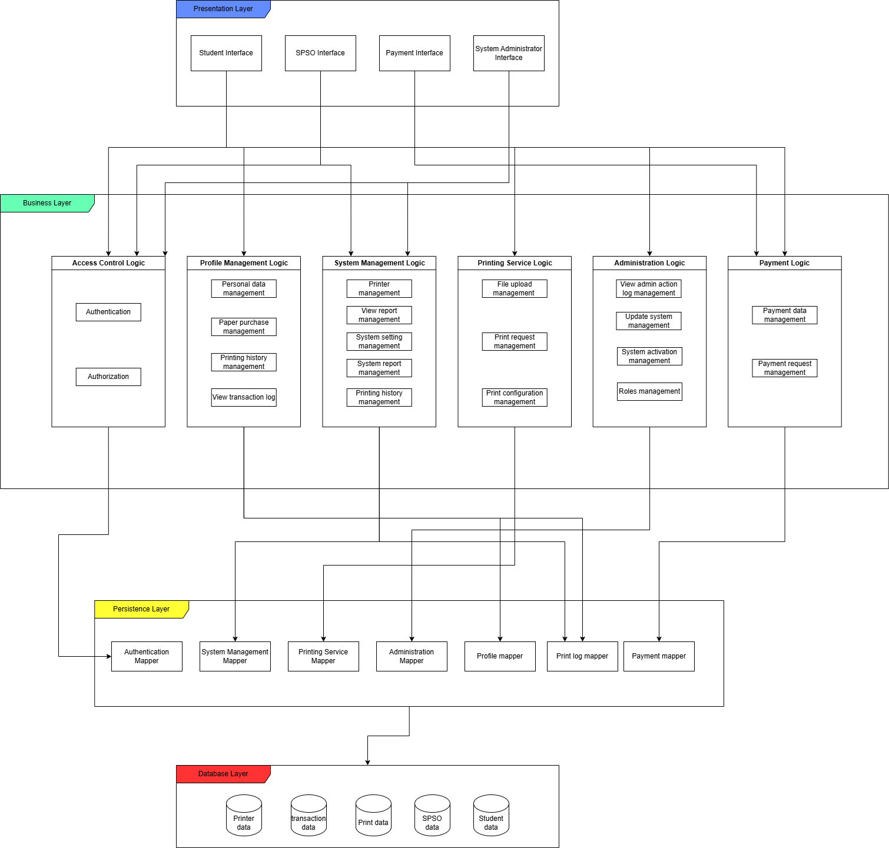
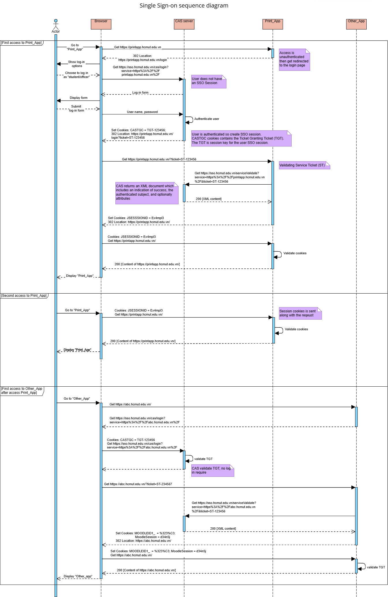
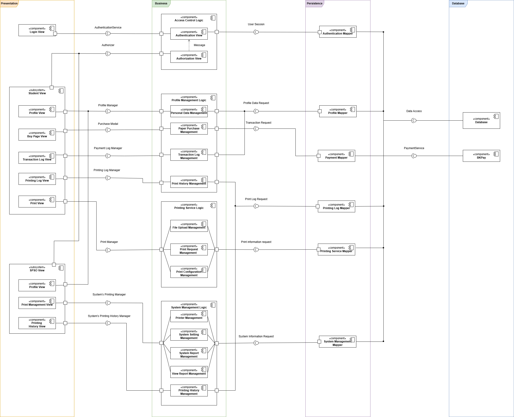

# Task 3: Architecture design

## Table of contents
- [Task 3: Architecture design](#task-3-architecture-design)
  - [Table of contents](#table-of-contents)
  - [Task 3.1 Layered Architecture](#task-31-layered-architecture)
    - [Presentation strategy](#presentation-strategy)
      - [Common Interface for Every Users](#common-interface-for-every-users)
      - [Student Interface](#student-interface)
      - [SPSO Interface](#spso-interface)
    - [Data Storage Approach](#data-storage-approach)
    - [External Services/API](#external-servicesapi)
  - [Task 3.2 Component Diagram](#task-32-component-diagram)

## Task 3.1 Layered Architecture

### Presentation strategy
The Presentation Layer will be a web-based interface, accessible on both desktop and mobile devices. The system interface is role-dependent, every page have a navigation bar to easily access to other pages or modules. Navigation options within the bar are based on the user’s role. A footer is included on every page with contact information, copyright details, and additional links (Facebook, email, Linkedin, ...).
System Interface is divided into 4 types:
-	Student Interface
-	SPSO (Student Printing Services Office) Interface
-	Payment Interface
-	System Administration Interface

#### Common Interface for Every Users
-	**Login Page:** Manages the authentication flow. All unauthenticated users must log in to access system services.
-	**Homepage:** Displays news, important announcements, and role-specific navigation. Unauthorized users see a default navigation bar identical to that on the student homepage navigate to login page if access any navigation options.
-	**Profile Page:** Allows authorized users to view their profiles, displaying details like name, email, and work position. For student profiles, additional sections for account balance and printing information are shown.

#### Student Interface
-	**Printing Documents:** An upload file area displays, allow the student select document(s) to print. After finish choosing document(s), relevant settings for each documents is shown, let student to choose a printer and customize the request. After submission, a confirmation page indicates the request's completion.
-	**Buy Pages:** An option helps students to purchase additional pages for printing. The page let student choose number of pages to purchase, show pricing information, payment options, and confirmation details.
-	**History:** Displays records of past print requests and page purchases, with the status of the request/transaction. Students can filter records by date to locate specific transactions.

#### SPSO Interface
-	**Printer Management:** Allows SPSO staff to view and manage available printers. This includes options to add/enable/disable printers as needed.
-	**System Management:** Provides access to system settings, including default handout page, default handout date or add/remove valid file types
-	**History:** Displays records of all printing requests across students, and statuses. Staff can filter records by date or student ID to view specific histories.

### Data Storage Approach
We will use MySQL for the HCMUT_SSPS system. MySQL is a user-friendly SQL database that is known for its high scalability, performance, and flexibility. It is a popular choice for beginners due to its ease of use and familiarity. Also, MySQL's document-oriented data model accommodates unstructured data with its flexible schema, making it a suitable option for systems with evolving data requirements. Moreover, MySQL's native replication and sharing capabilities allow the system to scale horizontally as the number of data increases, ensuring high availability and fault tolerance.

### External Services/API
According to the requirement, every student has to log in to the HCMUT_SSO authentication service prior to using the printing system. HCMUT_SSO authentication service is the central access service (CAS) server used to provide single sign-on (SSO) service. Therefore, we follow the protocol of the CAS server that students go through whenever logging into any app of the HCMUT system. If our assumption is correct, the following diagram should show how our application interacts with the CAS server.

## Task 3.2 Component Diagram

The diagram illustrates how the components of the Printing Service Module interact, including both the Student side and the management side from SPSO. The system is structured around the four layers outlined in the architecture design in the previous sections. This design encapsulates the code within each layer and enables communication between them through interfaces, enhancing the modularity of the code, which in turn improves both maintenance and security.

The presentation layer in this system is responsible for interacting with the user, displaying information, and capturing user input. It consists of various views and interfaces that the user directly interacts with. There are three main views in this layer: the login view, the student view and the SPSO view. The login view handles account authentication and authorization for different user groups when logging into the system. The student view features the profile view, buy page view, transaction log view, printing log view, and print view, each providing access to student information, purchase options, transaction history, print history, and document printing functions, respectively. The SPSO view includes the profile view, print management view and print history view, which allows the SPSO staff to view their personal information, adjust the printing settings of the system, and view the whole system’s printing history.

The business layer consists of four main components: access control logic, profile management logic, printing service logic and system management logic. Firstly, the access control logic handles the login, log out processes. Secondly, the profile management logic provides methods to access and modify personal information, manage personal A4 page balance through transaction methods, and access both printing services and transaction history.. Thirdly, the printing service logic supports students in printing documents. Lastly, the system management logic assists SPSO staff in overseeing the system's printing settings, generating reports, and reviewing print history.

The Persistence layer is made up of six main mappers. The authentication mapper links the authentication service from the authentication logic to the database. The profile mapper maps the personal data and transaction history from the profile management logic to the database. The payment mapper maps the paper purchasing data to the BKPay system. The printing log mapper and printing service mapper transfers the printing log data and the documents printing information from the print history management and printing service logic to the database. Lastly, the system management mapper maps the system management information from the system management logic, managed by the SPSO staff, to the database.

In the Database layer, this layer consists of a database module providing data to each data mapper in the Persistence layer. In this layer, the BKPay is also included for retrieving payment information.
