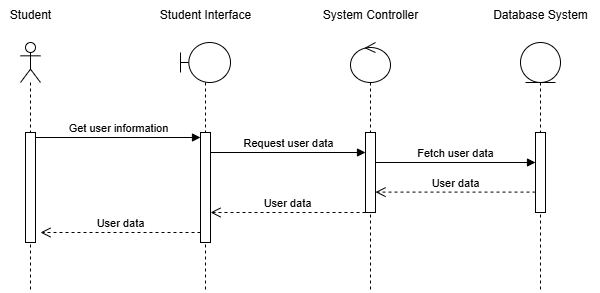

# Task 2: System modeling 

## Table of contents
- [Task 2: System modeling](#task-2-system-modeling)
  - [Table of contents](#table-of-contents)
  - [Task 2.1 Activity Diagrams](#task-21-activity-diagrams)
    - [UC001: View account information](#uc001-view-account-information)
    - [UC002: Print document](#uc002-print-document)
    - [UC003: View personal printing log](#uc003-view-personal-printing-log)
    - [UC004: Buy pages](#uc004-buy-pages)
    - [UC005: View transaction log](#uc005-view-transaction-log)
    - [UC006: Setting up the system (for SPSO)](#uc006-setting-up-the-system-for-spso)
  - [Task 2.2 Sequence Diagrams](#task-22-sequence-diagrams)
    - [Sequence diagram for use case View user information](#sequence-diagram-for-use-case-view-user-information)
    - [Sequence diagram for use case View printing log](#sequence-diagram-for-use-case-view-printing-log)
    - [Sequence diagram for use case View transaction log](#sequence-diagram-for-use-case-view-transaction-log)
    - [Sequence diagram for use case Buy A4 paper](#sequence-diagram-for-use-case-buy-a4-paper)
    - [Sequence diagram for use case Print document](#sequence-diagram-for-use-case-print-document)
    - [Sequence diagram for use case Setting up the System (for SPSO)](#sequence-diagram-for-use-case-setting-up-the-system-for-spso)
  - [Task 2.3 Class Diagrams](#task-23-class-diagrams)
    - [Model-View-Controller (MVC Pattern)](#model-view-controller-mvc-pattern)
    - [Singleton Pattern](#singleton-pattern)
    - [Observer Pattern](#observer-pattern)
  - [Task 2.4 User Interface (MVP1)](#task-24-user-interface-mvp1)

## Task 2.1 Activity Diagrams 
Before starting these use-case, the user must be authenticated to be student.
### UC001: View account information
The use-case starts when the student wants to check his/her account information. After clicking on the “view account information” button, the system then checks the request and displays the account information.

### UC002: Print document
When the student wants to send a print request, the system opens a window for the student to upload the documents to be printed. After the documents are uploaded, the system notifies the user if any types of the documents are not allowed; then the student is asked to upload the allowed types. In case the types of the documents are allowed, the system lets the student specify printing properties for each document individually; these properties include choosing the printed document to have one or both sides, choosing the number of copies, choosing the pages to be printed and choosing printing paper size. The system then shows the student the available printers on the campus. After the printer is selected, the total number of needed pages is shown to the user. Then the user can send the request; if the student does not have enough pages in his/her balance, the system notifies the student to buy more pages. If the student has enough pages, the request is sent to the printer. The printer log is taken immediately with the status set to be “waiting to be printed”.

### UC003: View personal printing log
If the student wants to see his/her printing log, the system shows all his/her printing log including the printing state. The student can choose the specific period of time to see printing logs in that period. If the period is invalid, the system shows a warning error. In case the period is valid, the system shows the printing logs with their states in the chosen period of time.

### UC004: Buy pages
After choosing to buy more pages, the system opens a window to buy more pages. The student then selects the number of pages to buy. After choosing a pay method and clicking the “Pay” button, the BK Pay system sends a QR code for the transaction. The student needs to carefully check if the payment details are correct. If the system waits for more than 10 minutes after having the QR code or payment failure happens, the system informs the student “Section timeout” or “Payment failure” respectively. If the payment is completed and BK Pay system receives money, the system updates the page balance of the student followed by transaction log taken and notification of successful payment.

### UC005: View transaction log
The use-case starts when the student wants to check his/her transaction log. After choosing to view the transaction log, the system displays the list of all past transactions. The user now can filter the time period of the transactions. After the specific transaction has been found, the user can click on it to see detailed information followed by close the view.

### UC006: Setting up the system (for SPSO)
The use-case starts when the SPSO wants to change the properties of the system. After the SPSO chooses to set-up the system, the system displays the list of all properties with the current set up. The SPSO now can change the properties of the system. After completing the set up, the SPSO can click on to save the setting and the changes are saved.

## Task 2.2 Sequence Diagrams
Before accessing these use cases, we must ensure that the system is enabled and that the student’s account has been authorized.
### Sequence diagram for use case View user information
This sequence diagram illustrates the use case viewing account information within the printing service module. In this use case, the student (actor) sends a request to the student interface to retrieve user information. The user interface then communicates with the system controller to request the user data. In turn, the system controller sends a message to the database to fetch the user data. The outcome of this process is the account information, which includes the student's name, ID, avatar, and A4 page balance.

### Sequence diagram for use case View printing log
This sequence diagram illustrates the use case view printing log within the printing service  module. In the view printing log use case, the student requests their printing log through the student interface. The interface sends a message to the system controller, which then retrieves the user’s printing history and the status of active print jobs from the database. At the conclusion of this use case, students will see their past printing history and the status of any ongoing printing sessions. Additionally, students have the option to filter the log by printing date. If a valid date is selected, the student interface will provide a filtered log based on that date. Conversely, if the selected date is invalid (e.g., in the future), an error message will be shown to the students. To do this, the student initiates a filter action via the student interface, which then instructs the system controller to filter the printing log, returning only the desired results. These results are then presented back to the student through the interface.

### Sequence diagram for use case View transaction log
This sequence diagram illustrates the use case view transaction log within the printing service  module. In the process of viewing the transaction log, the student initiates a request through the student interface for their transaction log. The student interface then relays this request to the system controller, which asks the database to query for the student’s transaction log. As a result, students can review their transaction history, including the dates of transactions and the number of A4 pages purchased during each transaction. Additionally, students have the option to filter the log by transaction date or transaction amount. To do this, the student initiates a filter action via the student interface, which then instructs the system controller to filter the transaction log, returning only the desired results. These results are then presented back to the student through the interface. Students can also choose a specific transaction to view the detailed information about it. In this process, the student initiates a request to get specific transaction information to the student interface, which then forwards the message to the system controller. The system controller then sends the message to the database to query for the relevant transaction. Once retrieved, the chosen transaction details are sent back to the student via the system controller and then the student interface. 

### Sequence diagram for use case Buy A4 paper 
This sequence diagram illustrates the process of a student purchasing A4 paper through an online system using BKPay for payment. The student begins by selecting the desired number of pages, which prompts the student interface to send a purchase request to the system controller, which then forwards it to the BKPay system. In response, BKPay generates a QR payment code and sends it back to the student. The student can then pay by scanning the QR code within 10 minutes; otherwise, a timeout error will occur, requiring them to restart the purchasing process. If the student completes the payment within the time limit, the transaction is recorded in the database, and the student’s A4 page balance is updated. Subsequently, a notification confirming the successful transaction and displaying the new balance is shown to the student. Conversely, if the payment fails due to reasons like insufficient funds or network issues, the student will receive a payment failure notification.

### Sequence diagram for use case Print document
This sequence diagram details the process a student follows to use the printing feature of the system, which includes uploading files, specifying printing properties, selecting a printer, and sending a print request. The use case begins when the student navigates to the printing page of the student interface and starts uploading files. The student can upload multiple files until they decide to proceed to the next step or reach the maximum limit. If an unsupported file type is uploaded, an error message will inform the student. After uploading, the student can adjust page formatting, select the number of copies, and choose other printing properties such as color options and page layout for each file the student uploaded. Next, the student requests a list of available printers through the student interface, which sends a request to the system controller. The controller retrieves printer information (name, ID, position, status) from the printer actor and sends this list back to the student interface for the student to select a printer. The selected printer's ID is confirmed and returned to the student. If the student chooses to cancel the printing session, all information is discarded, and they are returned to the original screen. Conversely, if the student opts to print, a print request is sent to the system controller via the student interface. The controller checks the student's page balance in the database. If the balance is sufficient, the system proceeds by creating a printing session object, which forwards the necessary files and properties to the printer. The printer then sends a printing status back to the session object, which updates the student's A4 page balance and saves the session as a printing log in the database. This printing status is subsequently replied back to the student through system controller and student interface. However, if the student's page balance is insufficient, an error message will be sent from the system controller, indicating that the student needs to follow the purchasing process (use case ID: UC004) before proceeding with the printing process.

### Sequence diagram for use case Setting up the System (for SPSO)
This sequence diagram illustrates the process when SPSO sets up the system. When the SPSO wants to change the properties of the system, a request is sent to the controller. After that, a list of all properties of the system with current set up is showed on the screen. SPSO choose the suitable option for each property and when they complete setting up, the properties will be updated.

## Task 2.3 Class Diagrams 
The class diagram above describes the architecture of a smart printing service system where students can manage their printing, transactions, and printing history through the application. The relationships between objects are clearly defined through direct connection or interaction through controllers, creating a clear separation between classes.

### Model-View-Controller (MVC Pattern) 
**Model:**
1.	Student: Manages user information.
2.	PrintingLog: Saves the status of the printing process.
3.	TransactionLog: Saves user transaction information.
4.	Printer, File: Manages printers and printed documents.
5.	PurchaseInfo: Contains information about the quantity of paper, total transaction amount, and remaining time when purchasing paper.

**View:** HomePage, PrintPage, ProfilePage, PaperPurchasePage, and TransactionLogPage. They provide an interactive interface with the user.

**Controller:**
1.	LoginController: Manages login.
2.	ProfileController: Manages profile interface.
3.	PrintingController: Controls the printing process.
4.	TransactionLogController: Controls transaction history.
5.	PurchaseModalController: Coordinates paper purchase transactions.

### Singleton Pattern
***LoginController*** and ***ProfileController***
In the diagram, each of these controllers has a static instance property, indicating that only one instance is instantiated for each controller.
Purpose: Ensure that only one controller coordinates user login or profile information throughout the application lifecycle, avoiding multiple login sessions causing errors.	
### Observer Pattern
***PrintingLog*** and ***TransactionLog***
When the state of these logs changes, the corresponding controllers  PrintingHistoryController and TransactionLogController will be notified to update the user interface, making the system responsive in real time.

## Task 2.4 User Interface (MVP1)
Link to the interactable figma prototype: [Printing](https://www.figma.com/proto/OXCBLQu4UyBHzaXWHT7rXY/Printing?node-id=151-1460&node-type=canvas&t=OJE0iLW54GiJIISy-1&scaling=min-zoom&content-scaling=fixed&page-id=0%3A1&starting-point-node-id=17%3A488)